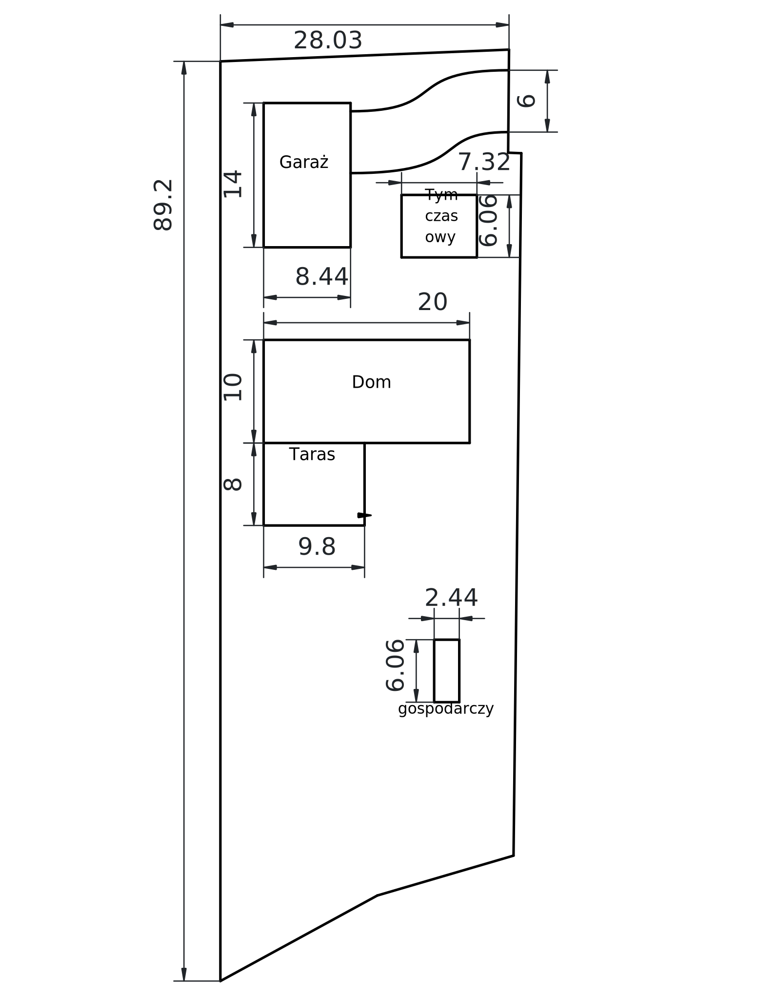
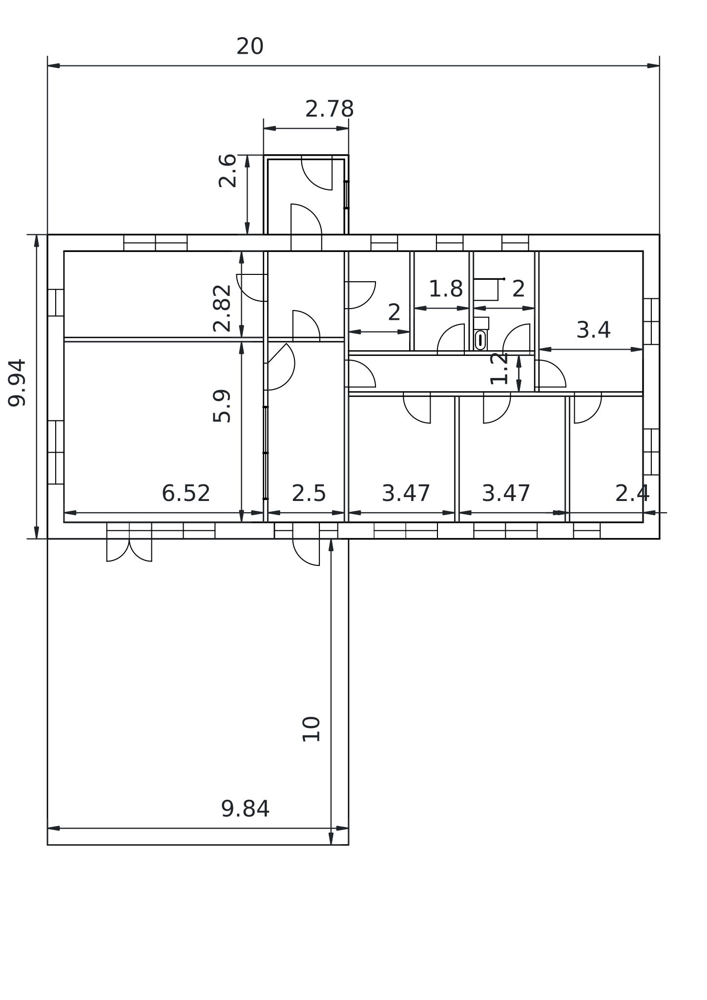

# Zwykły Dom

Pobierz ten dokument w formacie PDF

\clearpage

## Zagospodarowanie Przestrzeni

budynek opisany jako "tymczasowy" to mobilny dom, na czas budowy docelowego domu. Jeszcze nie wiem dokładnie jaki ten tymczasowy do ma być. Chciałbym w pierwszej kolejności załatwić wszystkie formalności z tym domem tymczasowym, (dom na zgłoszenie?).

Garaż chciałbym z piwnicą, lub z piętrem, tego jeszcze nie wiem.

\clearpage

## Plan Domu

podane wymiary to tylko orientacyjne, rozkład pomieszczeń to też nie wiem czy ma sens. Generalnie dom to tzw. nowoczesna stodoła, bez kominów, czy innych udziwnień. Poddasze nieużytkowe.

\clearpage

## Droga

Do działki prowadzi droga, której nie ma, jestem jej współwłaścicielem, będę potrzebować przygotować na razie taką drogę roboczą, nie wiem jakie formalności są konieczne.